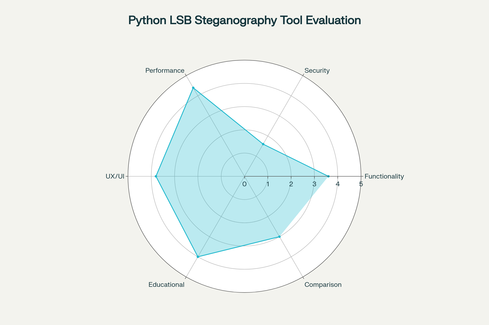
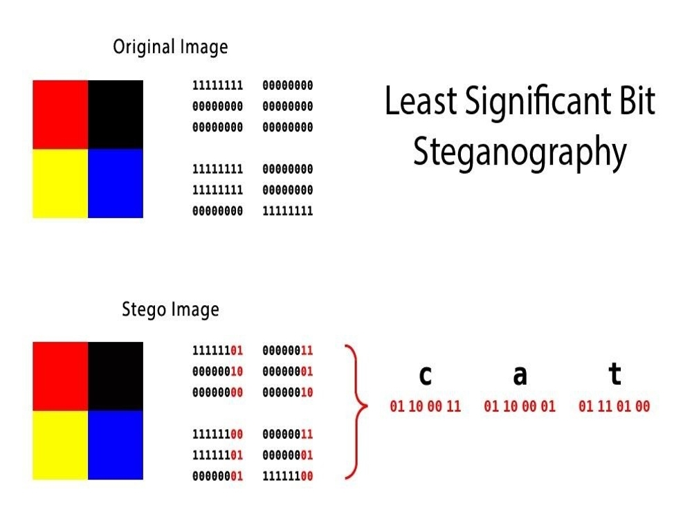
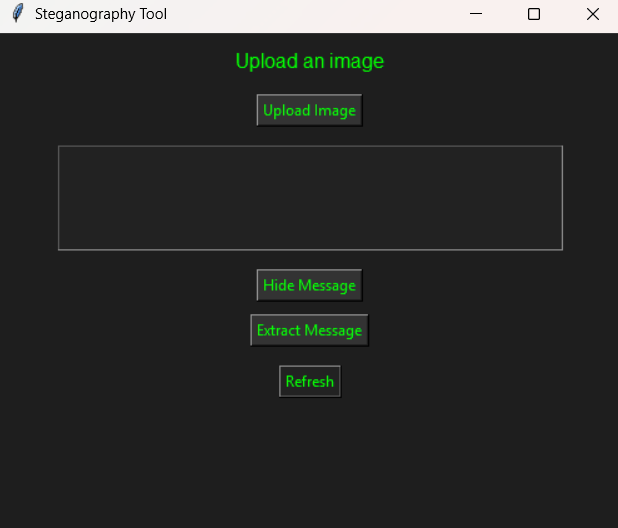

# Steganography Tool

A simple Python GUI tool to hide and extract secret messages inside images using **LSB (Least Significant Bit) steganography**.

## Features
- Hide secret text inside `.png` and `.bmp` images.
- Extract hidden messages with one click.
- Dark-themed GUI (hacker style).
- Refresh button to reset the interface.
- Error handling for missing inputs.

## Setup

### 1. Clone the repository
```bash
git clone https://github.com/suryansh-ai/steganography-tool.git
cd steganography-tool
```

### 2. Install dependencies
```bash
pip install -r requirements.txt
```

### 3. Run the tool
```bash
python gui.py
```

## Usage
1. Upload a `.png` or `.bmp` image.
2. Type your secret message in the text box.
3. Click **Hide Message** → Save the new image.
4. To retrieve, upload the modified image and click **Extract Message**.
5. Use **Refresh** to reset the interface.

## Screenshots
### Main Interface


### Message Hiding


### Message Extraction


## Project Structure
```
├── gui.py           # GUI application
├── stego.py         # Steganography logic
├── requirements.txt # Dependencies
├── SS-1.png         # Screenshot: Main Interface
├── SS-2.png         # Screenshot: Message Hiding
├── SS-3.png         # Screenshot: Message Extraction
```

## Created By
```
**Name:** Suryansh Pandey

**Internship:** Cyber Security Internship – Project 

**Date:** [07/09/2025]